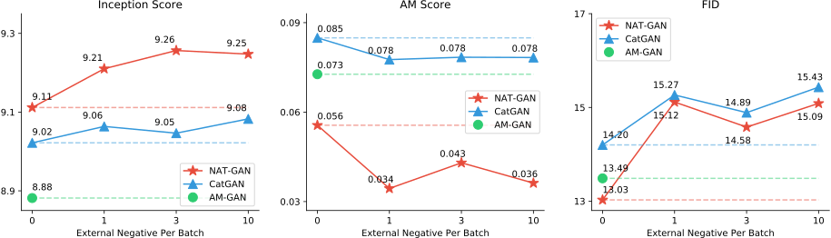
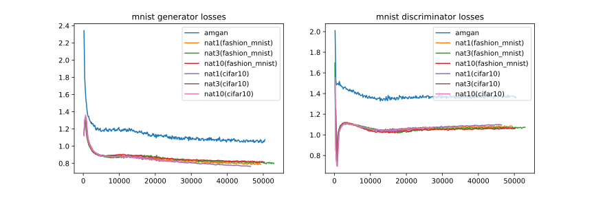

# Negative-Aware Training

**Please use Chrome to display videos, it may take a few seconds to load. This page is under updating!**

## 1D GAN

<div style="display: flex;justify-content:center; align-items:Center;">
    <video muted src="natgan3.mp4" type="video/mp4" controls="" autoplay="autoplay" loop="loop" width="1000px" height="600px">
    </video>
</div>

This video (natgan3.mp4) can be found in [github](https://github.com/natpaper/natpaper.github.io).

Code of 1D GAN is based on [gan-intro](https://github.com/AYLIEN/gan-intro).

The distributions are:

``` python
class DataDist:
    def __init__(self):
        self.mu = 4
        self.sigma = 0.5

    def sample(self, N):
        samples = np.random.normal(self.mu, self.sigma, N)
        samples.sort()
        return samples

class NegDist:
    def __init__(self):
        self.mu = 13
        self.sigma = 1

    def sample(self, N):
        samples = np.random.normal(self.mu, self.sigma, N)
        samples.sort()
        return samples

class NegDist2:
    def __init__(self):
        self.mu = -6
        self.sigma = 2

    def sample(self, N):
        samples = np.random.normal(self.mu, self.sigma, N)
        samples.sort()
        return samples
```

**Note: Discriminators of 1D and 2D NAT are outputting (by sigmoid) 0 for fake and neg data, and 1 for real, they are different from NAT-GAN on CIFAR 10, which output 0.1s for fake and neg data.**

## 2D GAN

<div style="display: flex;justify-content:center; align-items:Center;">
    <video muted src="nat2d.mp4" type="video/mp4" controls="" autoplay="autoplay" loop="loop" width="1000px" height="600px">
    </video>
</div>

This video (nat2d.mp4) can be found in [github](https://github.com/natpaper/natpaper.github.io).

The distributions are:

``` python
from sklearn.datasets import make_circles

class DataDist:
    def sample(self):
        x, y = make_circles(n_samples=2000, noise=.08)
        return x[y == 0] * 4
        
class NegDist1:
    def sample(self, N):
        x, y = make_circles(n_samples=2000, noise=.08)
        return x[y == 0] * 8

class NegDist2:
    def sample(self, N):
        x, y = make_circles(n_samples=2000, noise=.5)
        return x[y == 0] * 0.7
```

Note: The negative distribution may increase the difficulty of discriminator, hence you may need to decrease the weight of negative loss.

## NAT on MNIST

Fashion MNIST is the negative dataset.

|Test Sets|Fashion MNIST Train|Fashion MNIST Test|Random|
|:-:|:-:|:-:|:-:|
|NCR 0.4 baseline|0.853|0.556|0.987|
|NCR 0.4 NAT|0.0006|0.0014|0.0044|
|NCR 0.6 baseline|0.533|0.533|0.834|
|NCR 0.6 NAT|0.0002|0.0002|0.0004|
|NCR 0.8 baseline|0.302|0.303|0.615|
|NCR 0.8 NAT|0|0|0|
|NCR 0.9 baseline|0.192|0.192|0.538|
|NCR 0.9 NAT|0|0|0|

If use CIFAR 10 (gray scale) as negative dataset, the random results are poor.

## NAT on CIFAR 10

Our supervised classification code on CIFAR 10 is based on [pytorch-cifar](https://github.com/kuangliu/pytorch-cifar).

We implement the criterion:

``` python
class NATLoss(nn.Module):
    def __init__(self):
        super(NeutralCE, self).__init__()
        self.ce = nn.CrossEntropyLoss()
        self.logsoftmax = nn.LogSoftmax(dim=1)
        self.kl = nn.KLDivLoss(reduction='batchmean')
        
    def forward(self, input, target, phase='test'):
        if phase != 'train':
            return self.ce(input, target)
        pos_idx = target != -1
        neg_idx = target == -1
        ce_loss = self.ce(input[pos_idx], target[pos_idx])
        neg_loss = self.kl(self.logsoftmax(input[neg_idx]), torch.tensor([[0.1] * 10]).repeat(input[neg_idx].shape[0], 1).to(device))
        return ce_loss * sum(pos_idx) / input.shape[0] + neg_loss * sum(neg_idx) / input.shape[0]
```

Note, if you use BCE loss in pytorch, the network performance on negative samples is slightly weaker compared with our results in paper.<br>
The ILSVRC2012 samples used in paper are:
```
n01514668, n01440764, n01484850, n01494475, n01496331, n01443537, n01491361, n01498041, n01675722, 
n01629819, n01630670, n01632458, n01631663, n01632777, n01689811, n01693334, n01675722, n01694178, 
n01692333, n01694178, n01695060, n01688243, n01693334, n01689811, n01728572, n01751748, n01755581, 
n01749939, n01753488, n01756291, n01773797, n01774384, n01775062, n01774750, n01776313, n01774384
```

## NAT-GAN on CIFAR 10



For NAT-GAN on CIFAR 10, negative data is CIFAR 100, and code will be available soon, and you can easily implement it by modifying 
[AM GAN](https://github.com/ZhimingZhou/AM-GAN2), some important codes are:

``` python
fake_logits = discriminator(fake_datas, num_logits)
fake_logits2 = discriminator(tf.concat([fake_datas, next(neg_gen)[0]], 0), num_logits)

dis_fake_loss = kl_divergence(tf.ones_like(fake_logits, tf.float32) / num_logits, tf.nn.softmax(fake_logits))
dis_fake_loss2 = kl_divergence(tf.ones_like(fake_logits2, tf.float32) / num_logits, tf.nn.softmax(fake_logits2))
```

Set class number=10, batchsize=256, and you'd better add negative samples every 10 batches to allow model converge better.

Some generated samples are available in [github](https://github.com/natpaper/natpaper.github.io): 

> NAT-GAN, NAT-GAN_1, NAT-GAN_10, CatGAN, CatGAN_1, CatGAN_3, CatGAN_10, AM GAN

## NAT-GAN on MNIST

Negative data for MNIST are Fashion MNIST and CIFAR 10, below is the comparison of NAT and original AM GAN baseline, which means that negative information helps adversial procedure.


